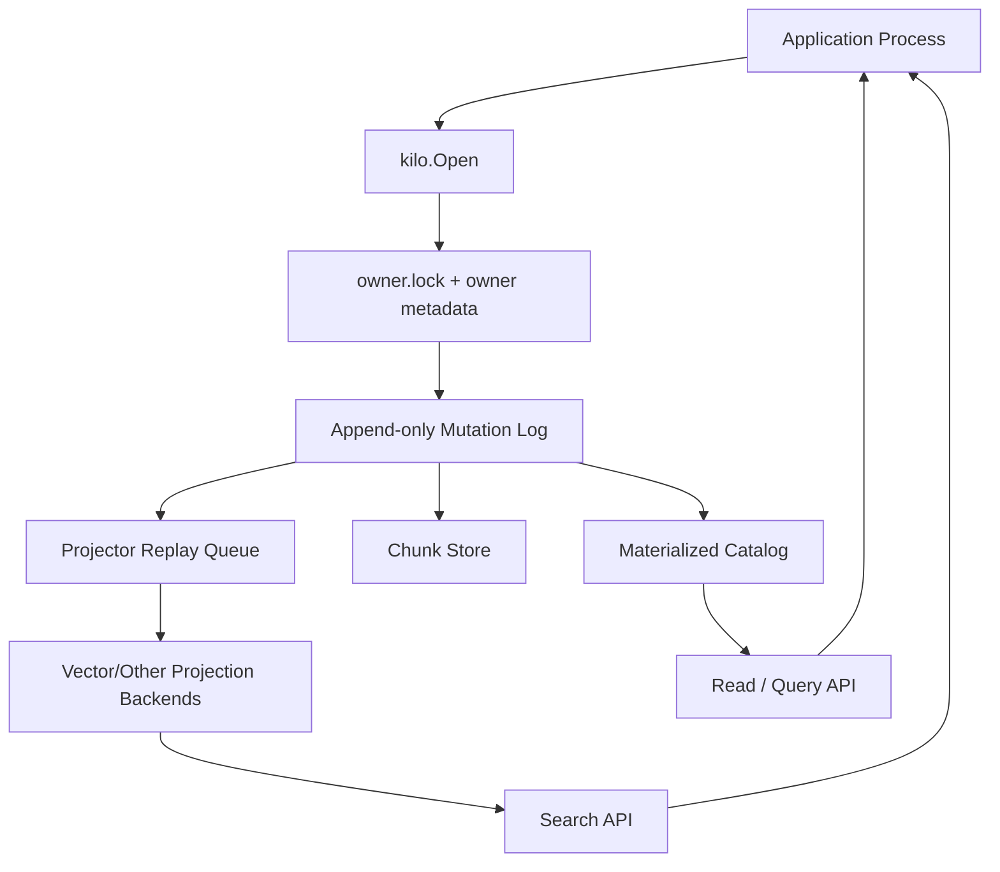

# Kilo

Kilo is an embeddable Go SDK for durable, auditable memory state in multi-agent systems. It is designed as a storage substrate first and an inspectable process second.

Kilo is released under the Apache License, Version 2.0.

## Positioning and non-negotiable boundaries

Kilo does **one thing**: provide a durable, append-only substrate for memory-like state.

- It is **not** an agent framework.
- It is **not** workflow policy.
- It is **not** authorization/authentication/routing middleware.
- It is **not** a vector database.

The repository provides:

- `pkg/kilo`: core SDK and durable state model.
- `cmd/kilo`: CLI + local HTTP inspection adapters.
- SugarFang import/validation tooling for neutral memory exports.

## Executive summary (technical)

Kilo is a **single-owner, log-structured memory kernel** with rebuildable projection layers.
The key design choice is to keep canonical truth append-only while treating search and analytical projections as secondary, replayable materializations.

This is intentionally close to an event-sourced core but constrained to a small, practical boundary:

- Write path: deterministic, append-only, audited.
- Current state: materialized locally from the canonical mutation stream.
- Projection paths: explicit watermarks and bounded staleness.
- Consumption path: read/query/search APIs from a single active owner.

The architecture is not “AI-ready magic infrastructure”; it is a conventional durable storage layer with explicit recovery properties.

## Core architecture



### Canonical invariants

Let `L` be the ordered mutation log and `S` be the materialized catalog state.

1. **Canonical truth invariant**: `S` is the result of replaying `L` from the active snapshot boundary.
2. **Single-writer owner invariant**: at most one active process owns a store path; a second `Open` returns `ErrStoreLocked`.
3. **Deterministic materialization**: replaying the same sequence of valid mutations yields the same materialized state.
4. **Explicit staleness invariant for projections**: search results carry `(DurableSeq, IndexedSeq, Lag)` and can report freshness status.
5. **Projection decoupling invariant**: projections are derived data and must not mutate canonical metadata semantics.

### Why this matters

The boundaries above let Kilo remain conservative under change:

- You can swap projection backends (exact search, ANN, or custom) without changing write semantics.
- You can reason about recovery because canonical history is never silently collapsed.
- You can detect lag between mutation acceptance and query-time projection freshness.

## Storage model in detail

### Canonical mutation stream

Every logical change enters Kilo as a `kilo.Write` envelope with metadata and one operation field set.

Shared write metadata includes:

- `IdempotencyKey`
- `ExpectedRevision` (optimistic concurrency)
- optional actor/timestamp information and metadata

Operations currently include:

- record create/update/delete-via-tombstone
- chunk create
- source span create
- node create/update/delete-via-tombstone
- edge create/delete-via-tombstone
- purge intent

### Data separation policy

Kilo separates metadata and large content by design:

- `Record`: compact metadata + provenance.
- `Chunk`: binary/textual body payloads stored outside the mutation payload.
- `SourceSpan`: ordered links from records into chunk references.
- `Node/Edge`: explicit hierarchy graph.

This separation avoids the “everything in one vector JSON blob” class of coupling and gives deterministic semantics for audits and compaction.

### Projectors and watermarks

Projectors consume replay events and build optional indexes. Each projector has explicit progress state:

- durable sequence seen
- indexed sequence
- lag
- last error

A projector can be considered up-to-date when lag is within your acceptance contract.

## Concurrency and lifecycle semantics

Kilo expects an embedding application to own the store path. This is operationally strict by design.

### Open / close lifecycle

1. `Open(path, options)` checks for existing ownership state.
2. If the lock is already active, `ErrStoreLocked` is returned.
3. Otherwise, Kilo initializes the owner lock and initializes runtime state.
4. A new owner handle is returned.
5. On `Close`, lock metadata is cleared and projections are stopped.

Ownership metadata is persisted in `<store>/owner.lock` and includes runtime hints (pid, host, path, open time).

### Write path constraints

- Writes flow through a single lock-held owner handle.
- Writes are durable-appended before current-state materialization.
- Idempotency keys protect duplicate submission paths.

### Read path semantics

Reads and queries are served from materialized state; tail reads are replay-oriented inspection.

- `Read`: point lookup forms.
- `Query`: structured traversals over nodes/edges/records/chunks.
- `Search`: projection path with explicit freshness controls.
- `Tail`: mutation inspection for debugging and auditability.

## Search is a projection, not a primitive store

Kilo supplies search through an injected `VectorSearcher` interface.

- `kilo.NewFileVectorIndex` is the current concrete exact-search projection.
- Projection can be swapped without changing write semantics.
- Search consumers can request freshness by setting `RequireFresh`.

`Search` returns enough metadata to evaluate whether ranking was computed over fresh projections.

## Installation

Kilo is a Go module:

```sh
go get github.com/LynnColeArt/Kilo-SDK/pkg/kilo@latest
```

If this repository is private in your environment:

```sh
go env -w GOPRIVATE=github.com/LynnColeArt/Kilo-SDK
```

## Minimal SDK usage

```go
package main

import (
	"context"
	"log"

	"github.com/LynnColeArt/Kilo-SDK/pkg/kilo"
)

func main() {
	ctx := context.Background()

	store, err := kilo.Open(ctx, kilo.Options{
		Path:       "/tmp/kilo-state",
		SyncWrites: true,
	})
	if err != nil {
		log.Fatal(err)
	}
	defer store.Close()

	_, err = store.Write(ctx, kilo.Write{
		IdempotencyKey: "example:create-memory",
		CreateRecord: &kilo.Record{
			ID:        "record:preference:go-sdk",
			Namespace: "project:kilo",
			Kind:      "preference",
			Summary:   "Kilo should remain embeddable as a Go SDK.",
			HumanID:   "human:lynn",
			Tags:      []string{"sdk", "memory"},
		},
	})
	if err != nil {
		log.Fatal(err)
	}

	read, err := store.Read(ctx, kilo.Read{RecordID: "record:preference:go-sdk"})
	if err != nil {
		log.Fatal(err)
	}
	log.Println(read.Record.Summary)
}
```

```sh
go test ./pkg/kilo
```

Additional runnable examples are in `pkg/kilo/example_test.go`.

## Search and projection example

```go
index, err := kilo.NewFileVectorIndex(kilo.FileVectorIndexOptions{
	Path:       "/tmp/kilo-state/vectors",
	SyncWrites: true,
})
if err != nil {
	return err
}

err = index.ApplyVectorOperation(ctx, kilo.VectorOperation{
	Type:           kilo.VectorOperationUpsert,
	NodeID:         "node:memory:engineering-preference",
	NodeType:       "memory_record",
	HierarchyScope:  map[string]string{"human_id": "human:lynn"},
	EmbeddingModel:  "example-embedding-v1",
	Vector:         []float32{1, 0},
	SourceSeq:      store.Status().DurableSeq,
})
if err != nil {
	log.Fatal(err)
}

result, err := store.Search(ctx, kilo.Search{
	VectorSearcher: index,
	Vectors: &kilo.VectorSearchQuery{
		Vector:         []float32{1, 0},
		NodeTypes:      []string{"memory_record"},
		HierarchyScope:  map[string]string{"human_id": "human:lynn"},
		EmbeddingModel:  "example-embedding-v1",
		MinIndexedSeq:   store.Status().DurableSeq,
	},
	RequireFresh: true,
})
if err != nil {
	log.Fatal(err)
}

_ = result
```

`RequireFresh: true` promotes stale projection coverage to
`ErrStaleProjection` so critical flows can reject uncertain ranking.

## Operational flow for embedding applications

A common production pattern:

1. Start one owner process per store path with `kilo.Open`.
2. Ingest write envelopes from application transactions.
3. Serve reads and queries through that owner handle.
4. Run CLI/HTTP only for inspection, debug, or migration workflows.
5. Export validation artifacts and run offline pilot harnesses when needed.

If you need multiple user-facing UIs or external tools, use one of these patterns:

- co-locate all mutation/writes in one process and expose an API surface to readers, or
- schedule read-only snapshots/exports for secondary tools.

## API surface map

- `pkg/kilo`:
  - open/close/store lifecycle
  - write envelope semantics
  - read/query/tail/status APIs
  - search abstraction and exact projector adapter
- `cmd/kilo`:
  - store status/inspection
  - import pipeline
  - validation harness runner
  - local read-only HTTP endpoint

## CLI and adapter examples

```sh
go run ./cmd/kilo help
go run ./cmd/kilo status --path /path/to/store --pretty
go run ./cmd/kilo inspect record record:example --path /path/to/store --pretty
go run ./cmd/kilo tail --path /path/to/store --limit 20 --pretty
```

Import path:

```sh
go run ./cmd/kilo import-memory \
  --path /path/to/kilo-store \
  --input /path/to/memory.jsonl \
  --init \
  --namespace sugarfang \
  --project-id project:example \
  --human-id human:lynn
```

Validation path:

```sh
go run ./cmd/kilo validate-memory \
  --path /path/to/kilo-store \
  --input /path/to/memory.jsonl \
  --cases /path/to/validation-cases.json \
  --init \
  --parallel-sessions 8 \
  --repeats 50 \
  --pretty
```

```sh
go run ./cmd/kilo serve --path /path/to/store --addr 127.0.0.1:8765
```

`kilo serve` remains intentionally minimal and local:

- read-only
- no authn/z
- no TLS termination

## Storage format overview

Current development format is documented in `docs/FILE_FORMAT.md`.

Conceptually:

- `segments`: append-only mutation stream.
- `chunks`: detached body files.
- `snapshots`: materialized checkpoints.
- `compactions`: manifest + archived history.
- `projectors`: projector checkpoints.
- `vectors`: durable vector payload and metadata.

These are versioned and auditable, with explicit compatibility context.

## Verification baseline

```sh
go test -count=1 ./...
go vet ./...
go test -race -count=1 ./...
go test -cover ./...
go run golang.org/x/vuln/cmd/govulncheck@latest ./...
```

## FAQ

### Is Kilo a vector database?

No.

Kilo is a storage substrate for durable memory state with append-only canonical truth.
Search projection is an injected layer built from mutation events and replayed into
adapters such as a file-backed exact vector index. The projection layer is replaceable;
it is not the canonical source of memory truth and is not where the system’s authority
lives.

### Can two processes write to the same store?

No. Kilo is currently single-owner by design. A second writer sees `ErrStoreLocked`.

### Why is this not just an event-sourcing framework?

It is close to event sourcing in shape but scoped narrower for production usage:
log-replay + owner lock + projection watermarks + SDK embedding boundary.

### What does “stale projection” mean?

It means the durable mutation sequence is ahead of the projection sequence used for
search. In strict mode, this is a hard signal (`ErrStaleProjection`).

## License

Kilo is released under the Apache License, Version 2.0.

See [`LICENSE`](LICENSE) for full text: https://www.apache.org/licenses/LICENSE-2.0

## Documentation map

- `docs/API.md`: public SDK behavior, errors, and contracts.
- `docs/FILE_FORMAT.md`: on-disk format and versioning model.
- `docs/ADAPTERS.md`: CLI and HTTP behavior.
- `docs/SUGARFANG_PILOT_IMPORT.md`: import contract.
- `docs/PILOT_VALIDATION.md`: validation harness and measurement protocol.
- `docs/TASK_LIST.md`: implementation milestone decomposition.
- `docs/CURRENT_STATE.md`: checkpoint state and verification snapshot.
